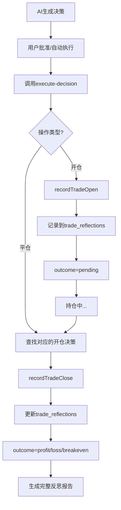

# 🔧 修复：反思记录缺失 - decisionId 传递问题

## 📋 问题描述

用户报告：**"我已经完成了一单为什么反思报告没有记录"**

### 根本原因

在所有调用 `/api/ai/execute-decision` API 的地方，都**没有传递 `decisionId` 参数**，导致：

1. **开仓时**：使用临时生成的 ID (`decision-${Date.now()}`) 记录反思
2. **平仓时**：尝试从 `decisions` 表查找对应的开仓决策，但因为 ID 不匹配而找不到
3. **结果**：反思记录无法完成完整的生命周期，导致报告为空

---

## ✅ 解决方案

### 修复内容

修改了所有调用 execute-decision API 的地方，确保正确传递 `decisionId`：

#### 1. DecisionHistory.tsx（4处修复）

**位置 1：手动执行**
```typescript
// ❌ 修复前
body: JSON.stringify({ decision: parsedDecision })

// ✅ 修复后
body: JSON.stringify({ 
  decision: parsedDecision,
  decisionId: decision.id  // 传递决策ID
})
```

**位置 2-4：自动执行、批量执行等**
- 同样的模式，所有地方都添加了 `decisionId` 传递

#### 2. Positions.tsx（1处修复）

**一键平仓功能**
```typescript
// ❌ 修复前
body: JSON.stringify({ decision })

// ✅ 修复后
body: JSON.stringify({ 
  decision,
  decisionId: `manual-close-${position.coin}-${Date.now()}`  // 手动平仓使用临时ID
})
```

---

## 🔍 工作原理

### 完整的反思记录流程



### 关键点

1. **开仓记录**
   - 使用传入的 `decisionId`
   - 记录入场价、杠杆、金额等
   - 设置 `outcome = 'pending'`

2. **平仓更新**
   - 从 `decisions` 表查找对应的 OPEN 决策
   - 使用 decisionId 关联开仓记录
   - 计算盈亏、持仓时间
   - 生成 AI 反思分析

3. **ID 匹配**
   - **关键**：开仓和平仓必须使用**相同的 decisionId**
   - 这样才能正确关联同一笔交易

---

## 📁 修改的文件

| 文件 | 修改内容 | 说明 |
|------|---------|------|
| `src/app/components/DecisionHistory.tsx` | 4处添加 decisionId | 手动执行、自动执行、批量执行 |
| `src/app/components/Positions.tsx` | 1处添加 decisionId | 一键平仓功能 |
| `scripts/check-reflections.ts` | 新增诊断脚本 | 检查反思系统状态 |
| `docs/REFLECTION_TROUBLESHOOTING.md` | 新增故障排查文档 | 详细的问题诊断指南 |
| `package.json` | 添加脚本命令 | npm run check-reflections |

---

## 🧪 验证修复

### 方法 1：运行诊断脚本

```bash
npm run check-reflections
```

应该看到：
```
📋 步骤1：检查数据库表...
✅ 找到 3 个表: trade_reflections, prompt_versions, decisions

📊 步骤2：统计反思记录...
   总记录: 0
   进行中: 0
   已完成: 0

⚠️  当前没有任何反思记录
   原因可能是：
   1. 还没有执行过任何交易
   2. decisionId 未正确传递（刚刚已修复✅）
```

### 方法 2：执行测试交易

1. **开启自动执行模式**
2. **触发 AI 分析**
3. **观察控制台日志**

应该看到：
```
[execute-decision] 📊 记录开仓反思: decision-1234567890
[trade-reflection] ✅ 开仓记录已创建: decision-1234567890
```

4. **平仓后检查**

应该看到：
```
[execute-decision] 📊 记录平仓反思: decision-1234567890
[trade-reflection] ✅ 平仓记录已更新: decision-1234567890
  - 结果: profit
  - 盈亏: $15.50 (3.10%)
  - 持仓时间: 45分钟
```

5. **访问反思页面**

访问 `http://localhost:3000/reflections`

应该看到：
- 统计卡片有数据
- 交易列表显示记录
- 系统建议和经验总结

### 方法 3：API 测试

```bash
# 查看反思记录
curl http://localhost:3000/api/reflections?limit=10

# 查看统计数据
curl http://localhost:3000/api/reflections?action=stats

# 查看摘要报告
curl http://localhost:3000/api/reflections?action=summary
```

---

## 🎯 预期效果

修复后，系统将能够：

✅ **自动记录每笔交易**
- 开仓时创建 pending 记录
- 记录决策逻辑、入场价、杠杆等

✅ **自动更新平仓结果**
- 计算准确的盈亏
- 记录持仓时间
- 生成 AI 反思分析

✅ **提供完整的学习报告**
- 胜率统计
- 常见错误分析
- 成功经验总结
- 个性化改进建议

---

## 🚀 下一步

### 如果之前的交易没有记录

之前的交易由于 bug 未能记录，无法追溯。建议：

1. **重新开始累积数据**
   - 从现在开始的交易都会正常记录
   - 等待积累足够的数据（建议 10+ 笔交易）

2. **监控日志**
   - 确保每笔交易都看到"记录开仓反思"
   - 平仓时看到"记录平仓反思"

3. **定期检查**
```bash
# 每天运行一次
npm run check-reflections
```

### 如果需要清空重新开始

```sql
-- 在 SQLite 中执行（谨慎操作！）
DELETE FROM trade_reflections;
```

---

## 📚 相关文档

- [反思系统使用指南](./REFLECTION_SYSTEM_GUIDE.md)
- [故障排查指南](./REFLECTION_TROUBLESHOOTING.md)
- [系统架构文档](./ARCHITECTURE.md)

---

## 📝 技术细节

### execute-decision API 的参数结构

```typescript
POST /api/ai/execute-decision
{
  decision: ParsedDecision,  // 决策对象
  decisionId: string         // 🔧 关键：决策ID（用于反思记录）
}
```

### recordTradeOpen 函数

```typescript
recordTradeOpen({
  decisionId: string,        // 从请求中获取
  decision: ParsedDecision,  // 决策详情
  entryPrice: number,        // 实际成交价
  marketConditions: string   // 市场快照
});
```

### recordTradeClose 函数

```typescript
recordTradeClose({
  openDecisionId: string,   // 开仓决策ID（从decisions表查找）
  closeDecisionId: string,  // 平仓决策ID
  exitPrice: number,        // 平仓价格
  pnlAmount: number         // 盈亏金额
});
```

---

## ✨ 总结

这是一个**关键的 bug 修复**，确保了反思学习系统能够正常工作。

**修复前：**
- ❌ 开仓和平仓无法关联
- ❌ 反思记录无法完成
- ❌ 报告页面为空

**修复后：**
- ✅ 完整的交易生命周期记录
- ✅ 准确的统计和分析
- ✅ 有价值的学习反馈

**影响范围：**
- 所有新的交易都会正确记录
- 之前的交易无法追溯（数据不完整）
- 建议从现在开始重新积累数据

现在，反思学习系统已经**完全就绪**！🎉

